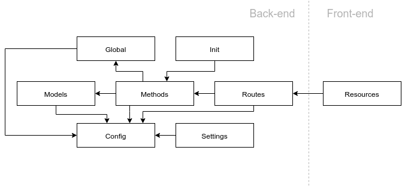

Guppy: A node js framework based on ExpressJS
-----------------------------------------------------

*Guppy is an open source NodeJS Framework based on ExpressJS,
the goal is to structure code and promote good programming practices providing a seed and some rules.*

## Seed structure

```bash
app.js 			# Main file
config.js 		# App configuration
public/.. 		# Public static files
src/ 			# App source files
	init/..
	front/..
	global/..
	models/..
	routes/..
	methods/..
	settings/..
```

## Modules



*Each arrow represents the connection of the modules, for example `Init` module just have access to `Methods` module.*


Module name | Access to	| Used by | Description
------------|-----------|---------|------------
Global | Config | Methods | App global variables
Init | Methods, Config | - | Initialize app
Models | Config | Methods | App persistent models
Methods | Global, Models, Config | Init, Routes | App available methods
Routes | Config, Methods | - | App available routes
Config | Global, Init, Models, Methods, Routes, Settings | - | App configuration
Settings | Config | - | App settings


## Links
- http://sequelize.readthedocs.org/en/latest/
- http://www.ijitee.org/attachments/File/v3i2/B1010073213.pdf
- https://en.wikipedia.org/wiki/Software_framework
- https://www.nsa.gov/ia/_files/support/guidelines_implementation_rest.pdf